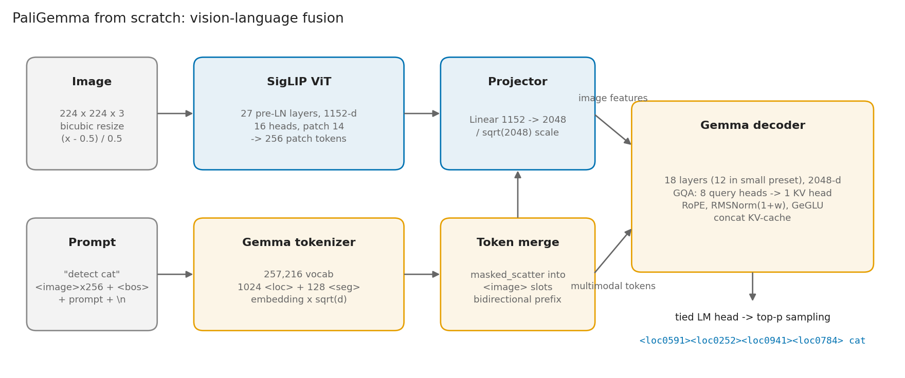
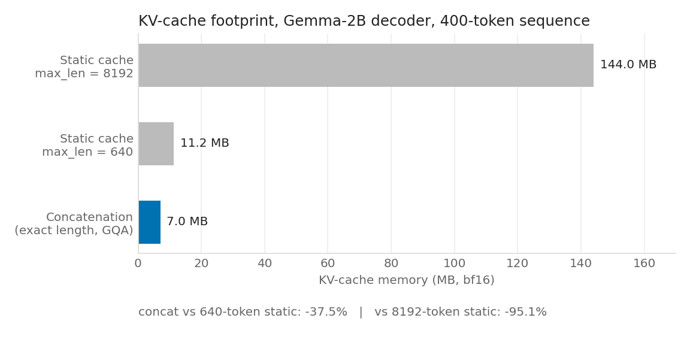
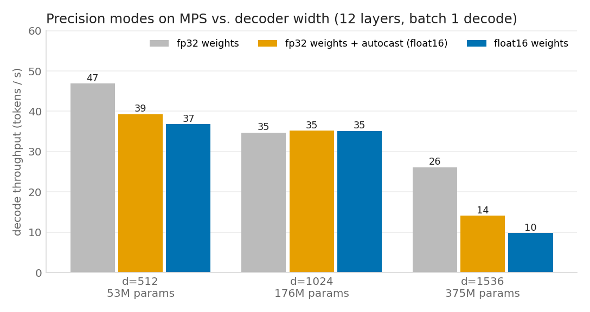
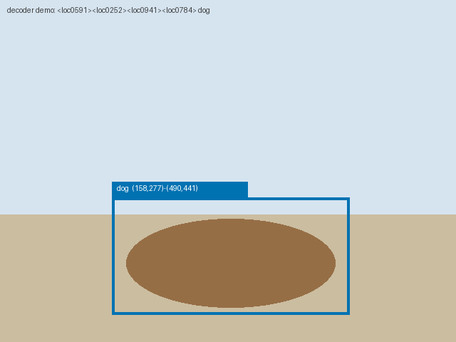
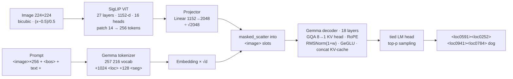

# VLMFromScratch

**A from-scratch PyTorch reproduction of PaliGemma** — Google's 3B vision-language model — that loads the
released SafeTensors checkpoint and runs captioning, visual question answering and object detection on
CUDA, Apple MPS or CPU.

Every module in [`vlm/`](vlm/) is hand-written: the SigLIP vision transformer, multi-head and
grouped-query attention, rotary position embeddings, RMSNorm, a concatenation-grown KV-cache,
multimodal token merging, weight tying and nucleus sampling. Nothing is imported from
`transformers` except the SentencePiece tokenizer.



## Highlights

| | |
|---|---|
| **Grouped-query attention + RoPE** | 8 query heads share 1 KV head (Gemma-2B). The KV-cache holds only the shared head and is grown with `torch.cat`, so it is exactly `prefix + generated` tokens long. **37.5 % less KV memory** than a static 640-token cache, 95 % less than the model's full 8192 context, 8× less than full MHA. |
| **Vision-language fusion** | Custom SigLIP encoder (27 pre-LN layers for the 3B weights; 6 in the small preset) → linear projector → features scattered into the `<image>` slots of a Gemma decoder (18 layers for the 3B weights, **12 layers** in the `paligemma_small` preset). Bidirectional prefix attention, causal generation. |
| **Detection** | `detect <object>` prompts decode to `<locYYYY>` tokens on a 1024-grid; [`vlm/detection.py`](vlm/detection.py) rescales them to pixel boxes and draws them. |
| **Production inference** | CUDA → MPS → CPU auto-placement, `torch.autocast` (bf16 on CUDA, fp16 on MPS), half-precision weight loading, top-p sampling, SafeTensors shard loading with strict key checking. |
| **Verified against the real checkpoint** | Config, preprocessor and all 300+ weight names match `google/paligemma-3b-pt-224` (checked via its ungated mirror, see [Verification](#verification-against-the-released-checkpoint)). |

## Results

### KV-cache memory

Analytical footprint for the Gemma-2B decoder config (18 layers, 1 KV head × 256 dims, bf16) on a
400-token sequence (256 image + 16 prompt + 128 generated). Reproduce with
`python scripts/benchmark_kv_cache.py`.



| Cache strategy | MB | vs. concatenation |
|---|---|---|
| Static pre-allocated, `max_len = 8192` | 144.00 | 20.5× |
| Static pre-allocated, `max_len = 640` | 11.25 | 1.6× |
| **Concatenation, exact length, GQA (this repo)** | **7.03** | 1× |
| Concatenation, full MHA (8 KV heads) | 56.25 | 8× |

### Mixed precision on Apple MPS

Measured on an 8 GB Apple M2 with the 12-layer decoder at three widths, batch-1 decode of 32 tokens,
best of 3 after warm-up (`python scripts/make_figures.py`).



| Decoder width | Params | fp32 | fp32 + autocast fp16 | fp16 weights | Weights fp32 → fp16 |
|---|---|---|---|---|---|
| d = 512 | 52.8 M | 46.9 tok/s | 39.3 tok/s | 36.8 tok/s | 211 → 106 MB |
| d = 1024 | 176 M | 34.7 tok/s | 35.2 tok/s | 35.1 tok/s | 705 → 352 MB |
| d = 1536 | 375 M | 26.1 tok/s | 14.1 tok/s | 9.8 tok/s | 1500 → 750 MB |

**Honest read:** on this machine batch-1 decoding is kernel-launch bound, so half precision does not
speed it up (it is slower at d = 1536, where an 8 GB laptop is also under memory pressure). What half
precision reliably buys is the **2× smaller weight footprint** — 5.8 GB instead of 11.7 GB for the 3B
checkpoint — which is what makes the model fit on a 16 GB Mac or an 8 GB GPU. Throughput gains from
autocast need tensor cores (CUDA) and larger batches; `inference.py` enables autocast on both back-ends
and lets you turn it off with `--autocast False`.

### Detection decoding

The decoder exercised on the example output from the [PaliGemma release blog](https://huggingface.co/blog/paligemma)
(`<loc0591><loc0252><loc0941><loc0784> dog`). This shows the parser and 1024-grid rescaling on a
synthetic scene; it is **not** a model prediction — run [`scripts/run_real_demo.py`](scripts/run_real_demo.py) for those.



Real-weight results (captions, VQA answers, detection overlays on COCO images) are produced by
`scripts/run_real_demo.py` into `assets/real/results.md`. It needs ~12 GB of disk and ≥ 8 GB of GPU memory
or a ≥ 16 GB Mac, and runs unchanged on a free Colab T4 — see [Run on real weights](#run-on-real-weights).

## Architecture



| Component | File | What is implemented |
|---|---|---|
| SigLIP encoder | [`vlm/siglip.py`](vlm/siglip.py) | Conv patchify (`padding="valid"`), learned position table, pre-LN blocks, tanh-GELU MLP, post-LN |
| Gemma decoder | [`vlm/gemma.py`](vlm/gemma.py) | `(1 + w)` RMSNorm in fp32, RoPE (`rotate_half`), GQA with `repeat_kv`, `torch.cat` KV-cache, GeGLU, `√d` embedding scale, tied `lm_head` |
| Fusion | [`vlm/paligemma.py`](vlm/paligemma.py) | Projector, `masked_scatter` token merge, all-zero prefix mask (bidirectional), cumulative position ids |
| Processor | [`vlm/processing.py`](vlm/processing.py) | Bicubic resize, `[-1, 1]` normalisation, `<image>`/`<loc>`/`<seg>` tokens, exact prompt layout |
| Detection | [`vlm/detection.py`](vlm/detection.py) | `<loc>` → pixel boxes (`value / 1024 × extent`, order y₀ x₀ y₁ x₁), overlay drawing |
| Generation | [`vlm/generate.py`](vlm/generate.py) | Prefill + single-token decode loop over the cache, nucleus sampling, greedy |
| Runtime | [`vlm/utils.py`](vlm/utils.py) | `get_device()`, `autocast_context()`, `load_hf_model()` with SafeTensors shards and tied-weight handling |
| Presets | [`vlm/configs.py`](vlm/configs.py) | `paligemma_3b_224` (matches HF weights), `paligemma_small` (12-layer decoder), `paligemma_tiny` (tests) |

### Why the KV-cache is grown by concatenation

```python
# vlm/gemma.py
self.key_cache[layer_idx] = torch.cat([self.key_cache[layer_idx], key_states], dim=-2)
```

A static cache must be sized for the longest sequence you might ever generate and pays for it from
step 0. Concatenating along the sequence axis keeps the cache exactly as long as the tokens seen, and
because GQA stores one KV head instead of eight, each cached token costs 2 × 18 × 256 × 2 B = 18 KB.
The trade-off is an O(S) copy per step; at PaliGemma's 128-token output budget that is negligible.

### Prefix-LM attention

PaliGemma attends **bidirectionally over the image and prompt** (the "prefix") and causally only over
generated tokens. With batch size 1 and no padding that means the additive mask is all zeros both in
prefill and in every cached decode step, which [`vlm/paligemma.py`](vlm/paligemma.py) builds explicitly.

## Quickstart

```bash
git clone https://github.com/<you>/VLMFromScratch-.git && cd VLMFromScratch-
pip install -r requirements.txt

python -m pytest -q                     # 24 tests, < 1 s on CPU
python scripts/smoke_test_device.py     # 12-layer preset end-to-end on your GPU / MPS with autocast
python scripts/benchmark_kv_cache.py    # KV-cache memory table
python scripts/make_figures.py          # regenerates assets/*.png and assets/results.json
```

### Run on real weights

`google/paligemma-3b-pt-224` is gated; `hehe156/paligemma-3b-pt-224` is an ungated, byte-identical mirror.

```bash
# downloads ~12 GB, then runs caption / VQA / detect on three COCO images
python scripts/run_real_demo.py --repo hehe156/paligemma-3b-pt-224 --dtype bfloat16
```

Or drive the model yourself:

```bash
python inference.py \
  --model_path weights/paligemma-3b-pt-224 \
  --prompt "detect cat" --image_file_path cat.jpg \
  --max_tokens_to_generate 64 --save_detections_to boxes.jpg
```

| Flag | Default | Meaning |
|---|---|---|
| `--prompt` | — | `caption en`, `answer en <question>`, `detect <object>`, `segment <object>`, `ocr` |
| `--do_sample` | `False` | greedy when off; nucleus sampling when on |
| `--temperature` / `--top_p` | `0.8` / `0.9` | sampling controls |
| `--device` | auto | `cuda`, `mps` or `cpu` |
| `--autocast` | `True` | bf16 on CUDA, fp16 on MPS |
| `--save_detections_to` | — | writes an image with the parsed `<loc>` boxes drawn |

`launch_inference.sh` wraps the same call with environment variables. The `-pt-` checkpoints are
pre-trained; the `-mix-` checkpoints follow free-form prompts better and load with the same code.

### Use as a library

```python
from PIL import Image
from vlm.utils import load_hf_model, get_device, autocast_context
from vlm.processing import PaliGemmaProcessor
from vlm.generate import generate
from vlm.detection import parse_detections

device = get_device()                                   # cuda > mps > cpu
model, tok = load_hf_model("weights/paligemma-3b-pt-224", device, dtype=torch.bfloat16)
vc = model.config.vision_config
proc = PaliGemmaProcessor(tok, vc.num_image_tokens, vc.image_size)

image = Image.open("cat.jpg")
inputs = {k: v.to(device) for k, v in proc(text=["detect cat"], images=[image]).items()}
with autocast_context(device):
    ids = generate(model, inputs["input_ids"], inputs["attention_mask"], inputs["pixel_values"],
                   eos_token_id=tok.eos_token_id, max_tokens_to_generate=32, top_p=0.9)
text = tok.decode(ids[0])
print(parse_detections(text, image.width, image.height))   # [Detection(label='cat', box=(x0, y0, x1, y1))]
```

## Verification against the released checkpoint

Fetched on 2026-09-17 from the ungated mirror and from `transformers` v4.49.0 source:

| Item | Source | Matches this repo |
|---|---|---|
| `config.json` — SigLIP 1152 / 4304 / 27 layers / 16 heads / patch 14; Gemma 2048 / 16384 / 18 layers / 8 heads / 1 KV head; vocab 257 216; image token 257 152 | [`hehe156/paligemma-3b-pt-224/config.json`](https://huggingface.co/hehe156/paligemma-3b-pt-224/blob/main/config.json) | ✅ `paligemma_3b_224()` |
| `model.safetensors.index.json` — every `vision_tower.*`, `multi_modal_projector.linear.*`, `language_model.model.*` key; no `lm_head` (tied) | [index](https://huggingface.co/hehe156/paligemma-3b-pt-224/blob/main/model.safetensors.index.json) | ✅ `state_dict()` keys, tied head handled in `load_hf_model` |
| `preprocessor_config.json` — mean/std 0.5, bicubic, 1/255, 224², 256 image tokens | [preprocessor](https://huggingface.co/hehe156/paligemma-3b-pt-224/blob/main/preprocessor_config.json) | ✅ `processing.py` |
| RMSNorm `(1 + w)` in fp32, `rotate_half`, `√d` embedding scale, GeGLU, `repeat_kv` | [`modeling_gemma.py`](https://github.com/huggingface/transformers/blob/v4.49.0/src/transformers/models/gemma/modeling_gemma.py) | ✅ |
| Image features ÷ `√text_hidden`, `masked_scatter` merge, bidirectional prefix mask | [`modeling_paligemma.py`](https://github.com/huggingface/transformers/blob/v4.49.0/src/transformers/models/paligemma/modeling_paligemma.py) | ✅ |
| Prompt = `<image>`×N + `<bos>` + text + `\n`; 1024 `<loc>` + 128 `<seg>` tokens | [`processing_paligemma.py`](https://github.com/huggingface/transformers/blob/v4.49.0/src/transformers/models/paligemma/processing_paligemma.py) | ✅ |
| `<loc>` value ÷ 1024, order y_min x_min y_max x_max | [HF PaliGemma blog](https://huggingface.co/blog/paligemma), [Google AI docs](https://ai.google.dev/gemma/docs/paligemma/prompt-system-instructions) | ✅ (fixed from ÷1023) |

## Tests

```
python -m pytest -q   →   24 passed
```

- RoPE preserves norms and is shift-invariant in dot products
- GQA output equals MHA exactly when KV heads are duplicated
- Cached single-token decode matches a full recompute
- Image features land in the `<image>` slots at the right scale; text tokens untouched
- Top-p never samples outside the nucleus; `<loc>` boxes rescale to the source image
- State-dict key names match the Hugging Face checkpoint layout

## Project layout

```
vlm/            siglip.py · gemma.py · paligemma.py · processing.py · detection.py · generate.py · utils.py · configs.py
inference.py    CLI (fire) — device auto-placement, autocast, top-p, detection overlay
scripts/        benchmark_kv_cache.py · make_figures.py · smoke_test_device.py · run_real_demo.py
tests/          24 unit tests on the tiny preset
assets/         generated figures + results.json
```

## References

- Beyer et al., [PaliGemma: A versatile 3B VLM for transfer](https://arxiv.org/abs/2407.07726) (2024)
- Zhai et al., [Sigmoid Loss for Language Image Pre-Training](https://arxiv.org/abs/2303.15343) (2023)
- Gemma Team, [Gemma: Open Models Based on Gemini Research and Technology](https://arxiv.org/abs/2403.08295) (2024)
- Ainslie et al., [GQA: Training Generalized Multi-Query Transformer Models](https://arxiv.org/abs/2305.13245) (2023)
- Su et al., [RoFormer: Enhanced Transformer with Rotary Position Embedding](https://arxiv.org/abs/2104.09864) (2021)
- Holtzman et al., [The Curious Case of Neural Text Degeneration](https://arxiv.org/abs/1904.09751) (2020)
- Hugging Face [`transformers`](https://github.com/huggingface/transformers) SigLIP / Gemma / PaliGemma sources and the [PaliGemma blog post](https://huggingface.co/blog/paligemma)
- Presentation inspired by [nipunbatra/vlm-from-scratch](https://github.com/nipunbatra/vlm-from-scratch) and [MaxLSB/mini-paligemma2](https://github.com/MaxLSB/mini-paligemma2)
